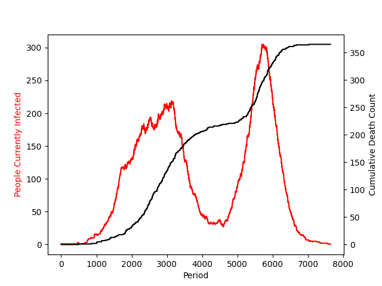

# Covid-19 Pandemic Simulation

This project is a pandemic simulation built using Python and the Pygame library. It simulates the spread of a contagious disease among a population of individuals within a confined area, displaying various stages of infection, recovery, immunity, and unfortunately, mortality.

## Demo


This plot illustrates the spread of the pandemic over time in the simulation. It shows the number of infected individuals and cumulative deaths as the simulation progresses.



## Table of Contents
1. [Introduction](#introduction)
2. [Features](#features)
3. [Requirements](#requirements)
4. [Installation](#installation)
5. [Usage](#usage)
6. [Controls](#controls)

## Introduction

The pandemic simulation project is designed to illustrate the spread and impact of infectious diseases within a population. It provides a visual representation of how diseases can proliferate based on various parameters such as infection distance, recovery time, immunity duration, and probability of transmission and mortality.

## Features

- **Visual Simulation:** Utilizes Pygame to create a graphical representation of the pandemic spread.
- **Randomized Movement:** Individuals move randomly within the simulation area, mimicking human behavior.
- **Infection Dynamics:** Implements infection mechanics where individuals can contract the disease based on proximity to infected individuals and transmission probabilities.
- **Health Status Tracking:** Tracks the health status of individuals including healthy, infected, immune, and deceased.
- **Real-time Statistics:** Provides real-time statistics on the number of infected individuals and cumulative deaths during the simulation.
- **User Interaction:** Allows users to control the simulation, including pausing, restarting, and closing the simulation window.

## Requirements

- Python 3.x
- Pygame library

## Installation

1. Clone the repository to your local machine:

    ```
    git clone https://github.com/yourusername/pandemic-simulation.git
    ```

2. Install the required dependencies using pip:

    ```
    pip install -r requirements.txt
    ```


## Usage

1. Run the simulation script:

    ```
    python pandemic_simulation.py

    ```

2. Control the simulation using keyboard commands (see [Controls](#controls)).

3. Observe the spread of the pandemic and analyze the simulation statistics.

## Controls

- **Esc:** Close the simulation window.
- **Enter:** Restart the pandemic simulation.
- **Space:** Pause or resume the simulation.


## TODO

### Ideas for Enhancements

- Implement mask-wearing behavior to modify the probability of disease transmission.
- Introduce a vaccination mechanism that directly immunizes individuals against the disease.
- Include social distancing measures to affect the probability of transmission.
- Enhance the demonstration by adding a GIF showcasing the simulation in action.

### Tasks

- [ ] Implement mask-wearing behavior and adjust transmission probabilities accordingly.
- [ ] Integrate a vaccination mechanism to directly immunize individuals.
- [ ] Add parameters for social distancing and modify transmission probabilities accordingly.
- [ ] Create a GIF demonstration showcasing the simulation in action.

Once these enhancements and tasks are completed, the pandemic simulation will be more comprehensive and visually engaging, providing a better understanding of disease spread dynamics and the effectiveness of various interventions.
